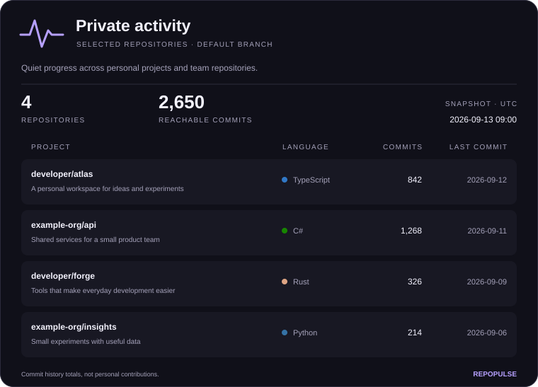

# RepoPulse

One GitHub activity card. A small personal NestJS API for selected repositories
across a personal account and an organization. Public source, private access by
default. No website, accounts, database, Redis, or scheduled jobs.



The card shows repository names, optional descriptions, primary languages,
default-branch commit counts, and latest commit dates. Both public and private
repositories are supported. The example above contains synthetic data.

## Run locally

Use Node.js 22 and pnpm 10.32.1.

```sh
pnpm install --frozen-lockfile
cp .env.example .env
# Fill in .env using the instructions below.
pnpm build
pnpm start
```

Generate a separate operator key with:

```sh
node -e "console.log(require('node:crypto').randomBytes(32).toString('base64url'))"
```

`pnpm dev` builds once and watches the compiled application. Run `pnpm build` after
TypeScript changes, or `pnpm exec tsc --watch` in another terminal. The application
loads `.env` locally; it never writes credentials or generated cards to disk.

## GitHub access

Create a **fine-grained personal access token** for your personal account. Choose
**Only select repositories**, select the repositories for this card, and grant
repository **Contents: read-only**. Metadata read is included. No write, Issues,
Pull requests, administration, or organization-members permissions are needed.

For organization repositories, create a second fine-grained PAT with that
organization as its resource owner. Obtain organization approval if required.
Configure its actual GitHub login, not its display name. A token restricted to your
personal account does not also authorize private organization repositories.
[GitHub's token setup guide](https://docs.github.com/en/authentication/keeping-your-account-and-data-secure/managing-your-personal-access-tokens).

RepoPulse routes each repository to its owner's credential and never falls back
to the other token. It fetches commit counts/dates, not source, diffs, messages, or
authors. **Contents read still grants the credential source-code access**; limit
repository selection accordingly. Set expiration dates and rotate PATs in deployment
settings. If your organization requires a GitHub App, use that authentication model
instead of broadening PAT permissions; App authentication is not implemented here.

## Configuration

| Variable                     | Meaning                                                                                                        |
| ---------------------------- | -------------------------------------------------------------------------------------------------------------- |
| `REPOPULSE_API_KEY`          | Required separate random operator secret, at least 43 base64url/hex characters                                 |
| `GITHUB_PERSONAL_OWNER`      | Required personal GitHub login                                                                                 |
| `GITHUB_PERSONAL_TOKEN`      | Required fine-grained personal PAT                                                                             |
| `GITHUB_ORG_OWNER`           | Optional organization GitHub login; requires its token                                                         |
| `GITHUB_ORG_TOKEN`           | Optional organization PAT; requires its owner                                                                  |
| `REPOPULSE_REPOSITORIES`     | Required JSON array of 1–12 unique entries: `{"repository":"owner/repo","description":"Optional description"}` |
| `REPOPULSE_PUBLISH_ACTIVITY` | `false` by default; only literal `true` publishes the SVG                                                      |
| `REPOPULSE_TITLE`            | Card heading; default `Private activity`                                                                       |
| `REPOPULSE_ABOUT`            | Short introduction; default `A snapshot of the projects I am building.`                                        |
| `REPOPULSE_THEME`            | `dark` (default) or `light`                                                                                    |
| `PORT`                       | Local port; default `3000`                                                                                     |

Configuration is validated on startup. Unknown owners, duplicate references,
invalid names, excess repositories, and half-configured organization credentials
are rejected. Appearance and repository selection are deployment settings;
there are no request parameters. Keep sensitive repository names/descriptions in
the environment, not in the public source repository.

## API

| Method and path      | Access                                          | Output                                     |
| -------------------- | ----------------------------------------------- | ------------------------------------------ |
| `GET /health`        | Public                                          | Dependency-free liveness JSON              |
| `GET /activity.svg`  | Operator, unless publication explicitly enabled | One fixed 760px-wide SVG                   |
| `GET /activity.json` | Always operator                                 | The same activity data and fetch timestamp |

HEAD follows the same access policy. All query parameters are rejected. Unknown
routes, including all old `/api/cards/*` routes, return 404.

```sh
# API_KEY below is the operator key, never a GitHub token.
curl --fail-with-body -H "Authorization: Bearer $API_KEY" \
  http://localhost:3000/activity.svg -o activity.svg

curl --fail-with-body -H "Authorization: Bearer $API_KEY" \
  http://localhost:3000/activity.json
```

No bearer key in URLs, README source, or client code. Errors preserve HTTP status:
400 for query parameters, 401 for operator authentication, 404 for missing or
inaccessible repositories, 502 for upstream failures, 503 for GitHub credentials,
permissions or rate limits, 504 for the overall deadline, and 500 for unexpected
rendering failures. Rate-limit responses include Retry-After. SVG errors contain
no repository details; JSON errors contain a stable code and request ID, never raw
GitHub errors. A partial GitHub failure fails the whole card rather than showing
an incomplete total.

## Embed in a README

To deliberately publish the card, set `REPOPULSE_PUBLISH_ACTIVITY=true` and redeploy:

```md

```

**This publishes every configured repository's name, description, primary language,
commit count, and latest commit date, plus the card heading/introduction.** Review
all of those fields before enabling it. JSON stays authenticated. An obscure image
URL does not make data private.

GitHub cannot fetch an image that requires your bearer header. Confidential activity
therefore stays behind the protected endpoint and cannot also be a live, publicly
readable README image. Downloading and committing the SVG publishes its contents
too. GitHub's image proxy and other viewers may retain previously published copies
after you disable publication. [GitHub image proxy documentation](https://docs.github.com/en/authentication/keeping-your-account-and-data-secure/about-anonymized-urls).

## Metric and cache semantics

- Commits are the history reachable from each repository's **current default
  branch**, across all authors and all time. They are not personal contributions.
  Shared history across repositories may be counted more than once in the total.
- Last commit is the latest history node's committed date, not push time.
- Counts of a million or more use compact notation on the SVG; JSON retains exact counts.
- Empty repositories show zero commits and no last date; inaccessible repositories
  are errors, not zeros. Rows sort by latest commit date, then repository name.
- One query batch per configured owner, normally one or two GitHub requests.
  Requests have a six-second timeout and one transient retry within a fifteen-second
  overall deadline. Response bodies and configured work are bounded.
- One five-minute in-memory snapshot and in-flight deduplication per instance.
  Failures are briefly backed off; quota failures honor Retry-After. No stale result
  is served after an expired snapshot fails to refresh.
- Protected output and errors are `private, no-store`. Public SVGs get a five-minute
  CDN lifetime and ETags. Origin and CDN TTLs can add up; README caching can add more.
  Memory does not persist or coordinate across serverless instances.

## Deploy to Vercel

1. Import the repository with the **NestJS** framework preset and Node.js **22.x**.
   Remove any previous Next.js output-directory override; use framework defaults.
2. Add the environment variables above. Paste JSON and secrets as values without
   the shell quotes used in `.env`. Keep production credentials out of untrusted
   preview deployments. Tests/builds do not need GitHub secrets.
3. Use the checked-in frozen install/build configuration. There is no cron, storage
   service, font asset, or writable filesystem requirement.
4. Verify `/health`, unauthorized `/activity.svg`, authenticated SVG/JSON, and both
   owner scopes. Enable public SVG publication only after reviewing the output.

The entrypoint is `src/main.ts`; Vercel's native Nest integration runs the app as
one Node function. Keep the function duration above the fifteen-second upstream
deadline (for example, 30 seconds) in the Vercel project settings. Do not add a
`functions` pattern for `src/main.ts`: it is a framework entrypoint, not a standalone
function under `api/`. [NestJS on Vercel](https://vercel.com/docs/frameworks/backend/nestjs).

Migrating an existing deployment is a breaking change: update README URLs, remove
the old cron and Redis settings, and rotate/replace old credentials. Rolling back
to the old public private-activity endpoint can republish metadata; do not restore
its private token as part of rollback.

## Development and security

**Existing deployments:** a credential was found in old Git revisions. Review the
[historical exposure notice](SECURITY.md#historical-credential-exposure) and revoke
the old token if necessary before reusing this deployment.

```sh
pnpm check
pnpm audit --audit-level=high
pnpm example
```

The repository intentionally does not include tests. `pnpm check` runs lint,
typechecking, a production build, and formatting checks without GitHub credentials.
`pnpm example` generates the fictional SVG shown above. Renderers use
XML escaping, validated colors, bounded dimensions and system fonts. No scripts,
remote images, remote fonts, arbitrary fetch URLs, or HTML rendering.

See [ARCHITECTURE.md](ARCHITECTURE.md) for the small runtime flow and
[SECURITY.md](SECURITY.md) for reporting and operational safeguards.
